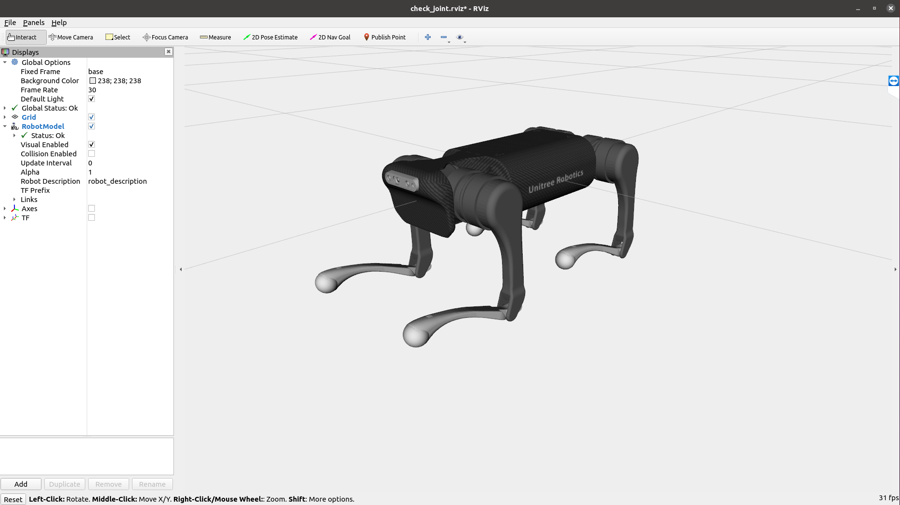
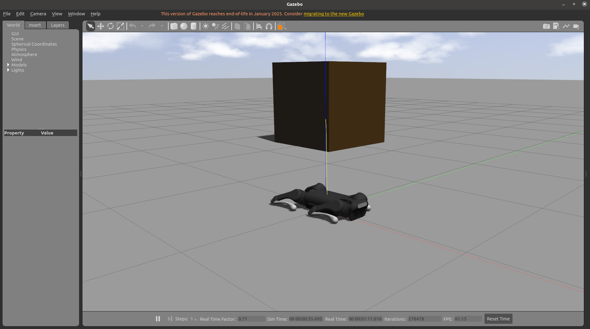
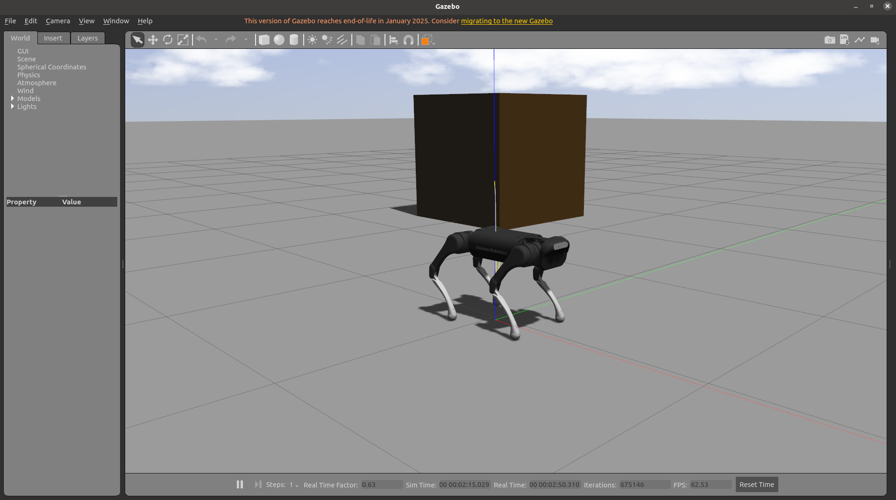
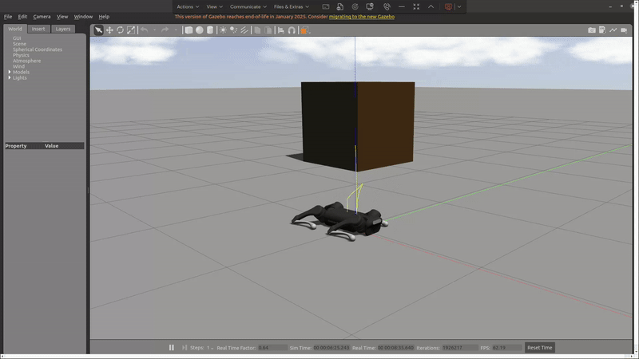
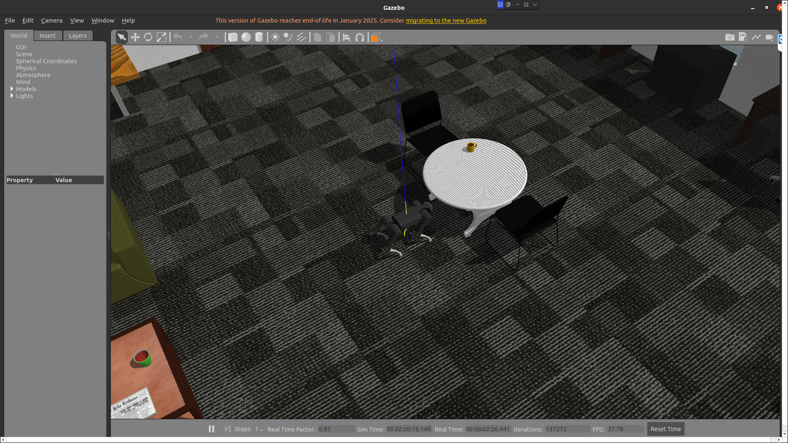
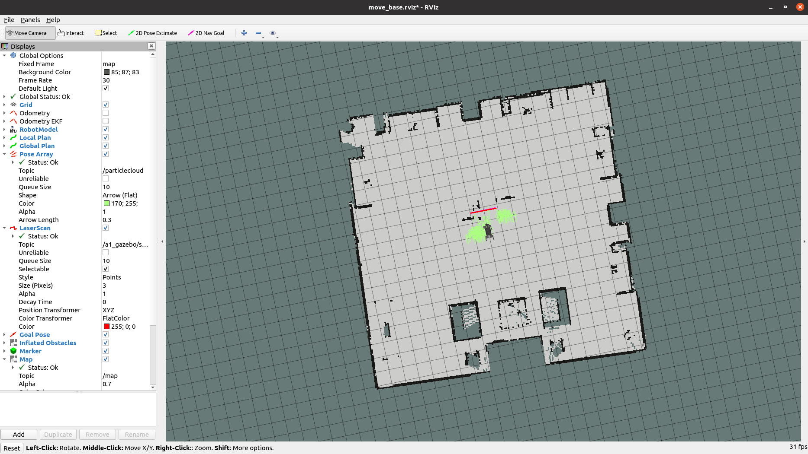
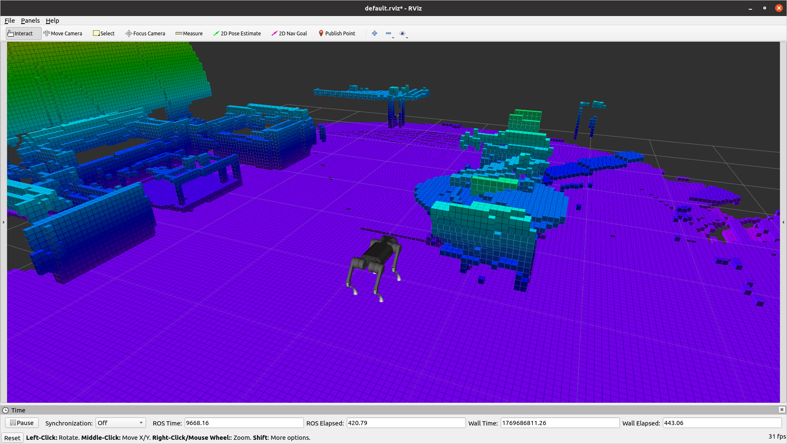
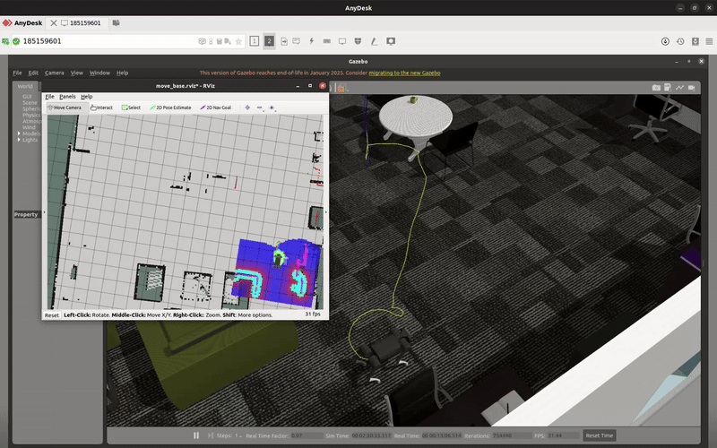

# Introduction
This repository is based on Unitree's repositories and aims to add the compatibility of the ROS packages with ROS Noetic. The list of the repositories considered is the following:
* [unitree_ros](https://github.com/unitreerobotics/unitree_ros)
* [unitree_ros_to_real](https://github.com/unitreerobotics/unitree_ros_to_real) (only the package `unitree_legged_msgs`)
* [unitree_guide](https://github.com/unitreerobotics/unitree_guide)

The repository contains all the necessary packages to run a simulation with Unitree robots as well as with real robot. You can load robots and joint controllers in Gazebo and you can move the robot in the environment. There are also packages that enable SLAM and navigation functionalities.

# Dependencies
* [ROS Noetic](https://www.ros.org/)
* [Gazebo](http://gazebosim.org/)

# Build

For ROS Noetic:
```
sudo apt-get update
sudo apt-get install liblcm-dev
sudo apt-get install ros-noetic-controller-interface ros-noetic-gazebo-ros-pkgs ros-noetic-gazebo-ros-control ros-noetic-joint-state-controller ros-noetic-effort-controllers ros-noetic-joint-trajectory-controller ros-noetic-amcl ros-noetic-move-base ros-noetic-slam-gmapping ros-noetic-hector-slam ros-noetic-map-server ros-noetic-global-planner ros-noetic-dwa-local-planner ros-noetic-rtabmap-ros
```

Clone this repository in the `src` folder of your catkin workspace:
```

```

And open the file `unitree_ros/unitree_gazebo/worlds/stairs.world`. At the end of the file (line 112):
```
<include>
    <uri>model:///home/unitree/catkin_ws/src/ros_unitree/unitree_ros/unitree_gazebo/worlds/building_editor_models/stairs</uri>
</include>
```
Please change the path of `building_editor_models/stairs` to the real path on your PC.

Then you can use `catkin_make` to build:
```
cd ~/catkin_ws
catkin_make
```

If you face a dependency problem, you can just run `catkin_make` again.

# Robots Description
The description of robots Go1, A1, Aliengo, and Laikago. Each package includes mesh, urdf and xacro files of robot. Take Go1 for example, you can check the model in Rviz by:
```
roslaunch a1_description a1_rviz.launch
```


# Start the Simulation
Open a terminal and start Gazebo with a preloaded world:
```
roslaunch unitree_gazebo robot_simulation.launch rname:=a1 wname:=earth
```
Where the `rname` means robot name, which can be `laikago`, `aliengo`, `a1` or `go1`. The `wname` means world name, which can be `earth`, `space` or `stairs`. And the default value of `rname` is `go1`, while the default value of `wname` is `earth`. In Gazebo, the robot should be lying on the ground with joints not activated.



For starting the controller, open a new terminal, then run the following command:
```
rosrun unitree_guide base_ctrl
```
After starting the controller, the robot will lie on the ground of the simulator, then press the '2' key on the keyboard to switch the robot's finite state machine (FSM) from Passive(initial state) to FixedStand, then press the '4' key to switch the FSM from FixedStand to Trotting



Now you can press the 'W', 'A', 'S', 'D' keys to control the translation of the robot, and press the 'J', 'L' keys to control the rotation of the robot. Press the 'Spacebar', the robot will stop and stand on the ground. If there is no response, you need to click on the terminal opened for starting the controller and then repeat the previous operation.



The full list of transitions between states available is the following:
* Key '1': FixedStand/FreeStand to Passive
* Key '2': Passive/Trotting to FixedStand
* Key '3': Fixed stand to FreeStand
* Key '4': FixedStand/FreeStand to Trotting
* Key '5': FixedStand to MoveBase
* Key '8': FixedStand to StepTest
* Key '9': FixedStand to SwingTest
* Key '0': FixedStand to BalanceTest

# Gazebo Worlds

The worlds included in this repository are simple worlds and they should be used for dedug purposes. If you want to add more realistc worlds, you can checkout the repository [gazebo_worlds](https://github.com/leonhartyao/gazebo_models_worlds_collection).
After following the instructions for the usage, you can specify which world you want to load with the argument `wname`:

```
roslaunch unitree_gazebo robot_simulation.launch rname:=a1 wname:=office_small
```



# Mapping

Start the simulation in Gazebo:
```
roslaunch unitree_gazebo robot_simulation.launch rname:=a1 wname:=office_small rviz:=false
```
Start the pcl2lasescan node:
```
roslaunch pcl2scan pcl2scan.launch rname:=a1
```

Start the robot controller:
```
rosrun unitree_guide base_ctrl
```


##NORMAL MAP


Start the mapping process with gmapping:
```
roslaunch unitree_navigation slam.launch rname:=a1 rviz:=true algorithm:=gmapping
```
Alternatively, you can start the mapping with hector:
```
roslaunch unitree_navigation slam.launch rname:=a1 rviz:=true algorithm:=hector
```
In the terminal of the robot controller, press the keys '2' and '4' to set the robot in trotting mode, then, move the robot around the environment to create the map.

During the mapping process, Rviz should show something similar to the following screehshot:


Save the map:
```
rosrun map_server map_saver -f ~/catkin_ws/src/ros_unitree/unitree_guide/unitree_navigation/maps/office_small
```


##OCTO MAP
start mapping with configured octomap package
```
roslaunch mapping3d_realsense mapping3d.launch 
```


save octomap created
```
rosrun octomap_server octomap_saver -f small_office_octopmap.bt /ot

```
Use MarkerArray from Rviz


# Navigation
Start the simulation in Gazebo:
```
roslaunch unitree_gazebo robot_simulation.launch rname:=a1 wname:=office_small rviz:=false
```

Start the robot controller:
```
rosrun unitree_guide base_ctrl
```
and press the keys '2' and '5' to activate the MoveBase mode.

Start the pcl2lasescan node:
```
roslaunch pcl2scan pcl2scan.launch rname:=a1
```

Start the navigation stack:
```
roslaunch unitree_navigation navigation.launch rname:=a1 map_file:=/home/isaac/Documents/catkin_ws/src/ros_unitree/unitree_guide/unitree_navigation/maps/office_small.yaml
```


Alternatively publish octomap:
```
rosrun octomap_server octomap_server_node src/ros_unitree/mapping3d_realsense/maps/small_office_octopmap.bt
```
Use MarkerArray from Rviz

In Rviz, first set the initial position of the robot with the "2D Pose Estimate" button. Next, set a navigation goal with the "2D Nav Goal" button.


"For static transform"
rosrun tf static_transform_publisher 0 0 0 0 0 0 1 map odom 100


# Note
If you are having problems with the movements of the robot and the node base_ctrl logs the following error:
```
[ERROR] Function setProcessScheduler failed.
```
Yo should consider to edit the file `/etc/security/limits.conf` and add the following two lines:
```
<username> hard rtprio 99
<username> soft rtprio 99
```
Replace `<username>` with your username.
Save, close the file and reboot the system to apply the changes.

---
#include <cstdint> Add this at the top of: grid_map/grid_map_core/include/grid_map_core/TypeDefs.hpp
#include <array>  Add this at the top of: grid_map_sdf/include/grid_map_sdf/SignedDistanceField.hpp
